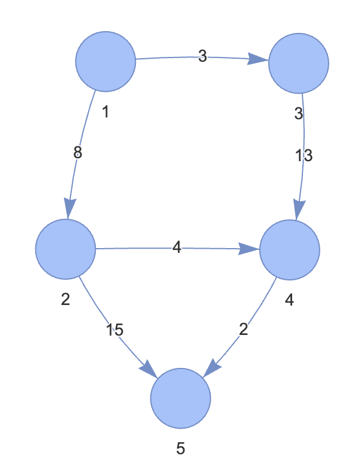

## 다익스트라 (dijkstra) 란 ? 

그래프에서 최단 거리를 구하는 알고리즘

- 기능 : 출발 노드와 모든 노드간의 최단 거리를 탐색
- 특징 : 엣지는 모드 엣지가 양수
- 시간 복잡도 : $O(ElogV)$ (E : 엣지 수, V : 노드 수)

## 핵심 이론



{1,2,8}, {1,3,3}, {2,4,4}, {2,5,15}, {3,4,13}, {4,5,2}

### 1. 인접 리스트로 그래프 구현
```
1 → 2(8), 3(3)  
2 → 4(4), 5(15)  
3 → 4(13)  
4 → 5(2)  
5 →  
```

### 2. 최단 거리 배열 초기화

최단 거리 배열을 만들고, 출발 노드는 0, 이외의 노드는 무한대로 초기화 <br>
```
노드:     1    2    3    4    5
거리:     0    ∞    ∞    ∞    ∞
```

### 3. 값이 가장 작은 노드 고르기

처음에는 일단 1번 노드를 고른다. (값, 즉 거리가 가장 짧으니까)


### 4. 최단 거리 배열 업데이트 하기

```
노드:      1    2    3    4    5
거리:      0    8    3    ∞    ∞
방문:     [1]   -    -    -    -
```
[] 는 확정된 노드


### 5, 과정 3~4 를 반복해 최단거리 배열 완성하기

노드 3에 대해서 3->4 이므로 D[3] + G[3->4] 업데이트

```
노드:      1    2    3    4    5
거리:      0    8    3   16    ∞
방문:     [1]   -   [3]   -    -
```


노드 2에 대해서 2->4, 2->5 이므로 최소값으로 업데이트
```
노드:      1    2    3    4    5
거리:      0    8    3   12   23
방문:     [1]  [2]  [3]   -    -
```

노드 4에 대해서 업데이트
```
노드:      1    2    3    4    5
거리:      0    8    3   12   14
방문:     [1]  [2]  [3]  [4]   -
```

노드 5에 대해서 업데이트
```
노드:      1    2    3    4    5
거리:      0    8    3   12   14
방문:     [1]  [2]  [3]  [4]  [5]
```

