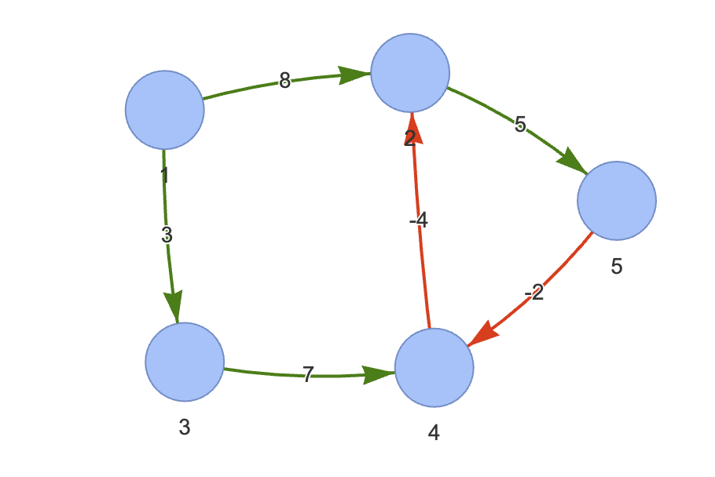

## 벨만-포드 알고리즘이란 ??

그래프에스 최단 거리를 구하는 알고리즘 

### 기능
 특정 출발 녿에서 다른 모든 노드까지의 최단 경로 탐색
### 특징 
1. 음수 가중치 엣지가 있어도 수행 가능 <br>
2. 전체 그래프에서 음수 사이클의 존재 여부를 판단할 수 있음 <br>
        (싸이클이어도 상관 없다는 얘기)

### 시간 복잡도  
(V : vertice, E : edge) <br>

책에서는 $O(VE)$ 라고 나온다.

하지만 Introduction to Algorithm 이란 책에서는 이렇게 나온다.
> $O(V^2 + VE)$, <br>$𝚯(V^2 + VE)$, <br> $𝝮(VE)$

The Bellman-Ford algorithm runs in $O(V^2 + VE)$ time<br> when the graph is represented by adjacency lists


-> 왜 시간복잡도가 위와 같은지 나중에 살펴볼 것


### 양의 싸이클, 음의 싸이클에 따른 차이점

싸이클의 종류에 따라 알고리즘 작동 방식이 달라진다.

```
1.	양의 사이클 (Positive Cycle):
	•	양의 가중치를 가진 사이클이 그래프에 존재할 경우, 
        벨만-포드 알고리즘은 정상적으로 최단 경로를 계산할 수 있습니다. 
        사이클을 반복적으로 돌아도 경로의 총 가중치가 증가하므로 최단 경로 계산에 문제가 되지 않습니다.

2.	음의 사이클 (Negative Cycle):
	•	음의 가중치를 가진 사이클이 그래프에 존재하면, 벨만-포드 알고리즘은 이를 감지할 수 있습니다. 
        음의 사이클이 존재하면 최단 경로가 무한히 작아질 수 있기 때문에, 
        알고리즘은 음의 사이클의 존재를 보고하게 됩니다.
        
        음의 싸이클이 있으면 해당 싸이클을 무한히 반복하여 거쳐갈 수 있기 때문에
        최단 경로의 의미가 무의미해짐.

	•	음의 사이클이 소스 노드로부터 도달 가능한 경우, 
        해당 그래프에서는 유한한 최단 경로을 정의할 수 없다고 판단됩니다.
```

### 양의 싸이클, 음의 싸이클이란 ?

싸이클을 이루는 모든 엣지의 가중치가 양수면 양의 싸이클, 음수면 음의 싸이클이다.

```
음의 싸이클 예시 1 
A → B (가중치 = -2)
B → C (가중치 = -3)
C → A (가중치 = -1)
```

``` 
음의 싸이클 예시 2
A → B (가중치 = 4)
B → C (가중치 = -10)
C → A (가중치 = 3)
```

```
양의 싸이클 예시 1
A → B (가중치 = 10)
B → C (가중치 = -5)
C → A (가중치 = 3)
```

## 과정

### 1. 에지 리스트로 그래프를 구현하고 최단 경로 배열 초기화 하기


<br>
<br>

- 그래프 에지 리스트 (ArrayList<edge> edges)

| Edge 번호 | 1  | 2  | 3  | 4  | 5  | 6  |
|-----------|----|----|----|----|----|----|
| 출발 노드 | 1  | 2  | 1  | 3  | 4  | 5  |
| 종료 노드 | 2  | 5  | 3  | 4  | 2  | 4  |
| 가중치    | 8  | 5  | 3  | 7  | -4 | -2 |

- 정렬 배열 (D[index])

| 인덱스 | 1    | 2    | 3    | 4    | 5    |
|--------|------|------|------|------|------|
| 값     | 0    | ∞    | ∞    | ∞    | ∞    |


### 2. 모든 엣지를 확인해 정답 배열 업데이트 하기

최단거리 배열에서 업데이트 반복횟수는 노드갯수 -1 이다. (?)

특정 엣지 $E = (s, e, w)$ 에 대하여 다음조건을 만족하며 업데이트를 실행


$D[s] ≠ ∞$, $D[e] > D[s] + w$ 이면  <br>
$D[e] = D[s]+w$ 로 업데이트.


(이때 s 는 출발노드, e 는 도착노드, w 는 가중치. <br>
D[s] 는 출발노드의 정답배열의 값, D[e]는 도착노드의 정답배열의 값)

```
(책에서는, 음수사이클이 없을때 최대 엣지개수가 나오려면 사향 트리형태에서 양 도착노드를 선택해야 한다고 나오는데, <br>
이해가 안된다. 애초에 사향트리에 대한 정의가 무엇인가 ?)
```

#### 과정 추이 (첫번째 순환)

|   과정  | 인덱스 | 1    | 2    | 3    | 4    | 5    |
|--------|--------|------|------|------|------|------|
|    0    | 값     | 0    | ∞    | ∞    | ∞    | ∞    |
|    1    | 값     | 0    | 8    | ∞    | ∞    | ∞    |
|    2    | 값     | 0    | 8    | 3    | ∞    | ∞    | 
|    3    | 값     | 0    | 8    | 3    | ∞    | 13    |
|    4    | 값     | 0    | 8    | 3    | 10    | 13    |
|    5    | 값     | 0    | 6   | 3    | 10    | 13    |
|    6    | 값     | 0    | 6   | 3    | 10    | 13    |

> 먼저, D[e] 를 계산하는 순서는 엣지리스트 순서가 아니다.  <br>
> $D[s] != ∞$ 이어야 한다.<br>
> 그러니까 어떤 시점에서, 엣지리스트들 중에 D[s] 가 ∞ 이 아닌 엣지에 대해 처리하면 된다. <br>
> 그럼 할때마다 $D[s] != ∞$ 인 엣지를 찾아야 하는데 이건 큐로 하면 될 듯.

> Start with Source node : 1, <br>
> Iterate procedure over edges of node 1.

```
과정 1 : (1,2,8) 에 대하여 
D[2] = min (∞, 0 + 8) = 8 

과정 2 : (1, 3, 3) 에 대하여
D[3] = min (∞, 0 + 3) = 3

과정 3 : (2,5,5) 에 대하여
D[5] = min (∞, 8+ 5) = 5

과정 4 = (3, 4, 7) 에 대하여 
D[4] = min (∞, 3 + 7) = 10

과정 5 = (4, 2, -4) 에 대하여
D[2] = min (8, 10 + (-4)) = 6

과정 6 = (5, 4, -2) 에 대하여
D[4] = min (10, 13 + (-2)) = 10
```

이것이 첫번째 순환이며, 정답 배열의 값이 변하지 않을때까지 또는 V -1 번 만큼 순환을 반복한다.

(책의 설명이 좀 이상한 것 같다)


#### Algorithm is Order-agnostic

```
벨만-포드 알고리즘은 traverse 하는 엣지의 순서와는 상관없이 결과는 동일하다.
예를 들어, 위 리스트에서 과정 2와 과정 5가 바뀌었다고 생각해보자.
과정 4일때는 D[4] = ∞ 이므로 진행할 수 없기때문에 skip 된다.

하지만 회차를 거듭할수록 과정 2를 먼저 한 것과 동일한 결과가 나온다.
```


### 3. 음수 사이클 유무 확인하기

그런데 과정 6 까지를 보면, <br>
(4, 2, -4) <br>
(2, 5, 5) <br>
(5, 4. -2) <br>
가중치 합 : -1 <br>
이렇게 음의 싸이클이 생기게 된다.

> 이걸 어떻게 판별하는지는 공부를 더 해봐야 한다.

책에서는 음의 싸이클이 존재하는지 판단하는데에서 끝내는데, <br>
사실 벨만-포드 알고리즘은 음의 싸이클이 없는 경우에 <br>
모든 엣지에 대한 과정을 V - 1 만큼 순환한다. <br>

만약 반복하는 과정에서 이전 순환과 값이 달라지는게 없다면 <br>
이미 최적화된 경로의 가중치를 찾은 것이므로 종료

그게 아니라면 V - 1 번만큼 순환.

V-1 번인 이유는, 경로의 가중치의 합이 최소가 되는 <br>
최대 엣지의 갯수가 V-1 개 이기 때문이다.

> 이부분에 대해서는 직관적인 이해가 필요하다. 

