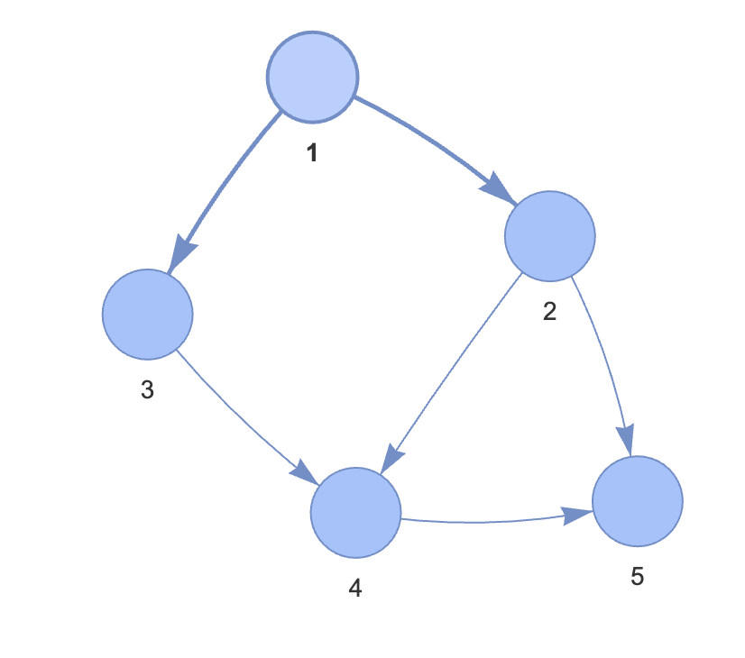

## 위상 정렬이란 ? 

사이클이 없는 방향 그래프에서 노드 순서를 찾는 알고리즘

- 기능 : 노드 간 순서를 결정
- 특징 : 사이클이 없어야 함
- 시간 복잡도 : $O(V + E)$ (V : 노드 수, E : Edge 수)

## 원리 이해하기

 
 
- 진입차수 : 자기 자신을 가리키는 엣지의 갯수

### 1. 진입 차수 배열 만들기

| 노드      | 1 | 2 | 3 | 4 | 5 |
|-----------|---|---|---|---|---|
| 진입 차수 | 0 | 1 | 1 | 2 | 2 |

예를 들면, 노드 1부터, 노드 1은 2, 3을 가리키므로 D\[2]++, D\[3]++

### 2. 진입차수 배열을 이용해 위상 정렬 배열 만들기

1. 진입 차수가 0인 노드를 선택, 그 노드를 정렬 리스트에 저장
2. 저장하면서 해당 노드가 가리키는 노드의 진입 차수를 1만큼 뺀다
3. 모든 노드가 정렬될때 까지 위 과정을 반복

>   1이 정렬 리스트에 들어간 시점에서 진입 차수가 0 인 노드는 2, 3  
>   만약 3을 먼저 선택했더라면 결과가 달라짐  
>   -> 위상 정렬은 반드시 같은 결과를 보장하지는 않는다.

### 위상 정렬 과정

**초기 큐**: [1]  
**정렬 리스트**: []

---

#### 단계 1: 노드 1 처리

1. **큐에서 노드 1 선택 및 제거**
2. **정렬 리스트에 노드 1 추가**

**노드 1의 인접 노드**: 2, 3  
**진입 차수 업데이트**:
- 노드 2: 1 → 0
- 노드 3: 1 → 0

##### 업데이트된 진입 차수 배열

| 노드      | 1 | 2 | 3 | 4 | 5 |
|-----------|---|---|---|---|---|
| 진입 차수 | - | 0 | 0 | 2 | 2 |

**큐**: [2, 3]  
**정렬 리스트**: [1]

---

#### 단계 2: 노드 2 처리

1. **큐에서 노드 2 선택 및 제거**
2. **정렬 리스트에 노드 2 추가**

**노드 2의 인접 노드**: 4, 5  
**진입 차수 업데이트**:
- 노드 4: 2 → 1
- 노드 5: 2 → 1

##### 업데이트된 진입 차수 배열

| 노드      | 1 | 2 | 3 | 4 | 5 |
|-----------|---|---|---|---|---|
| 진입 차수 | - | - | 0 | 1 | 1 |

**큐**: [3]  
**정렬 리스트**: [1, 2]

---

#### 단계 3: 노드 3 처리

1. **큐에서 노드 3 선택 및 제거**
2. **정렬 리스트에 노드 3 추가**

**노드 3의 인접 노드**: 4  
**진입 차수 업데이트**:
- 노드 4: 1 → 0

##### 업데이트된 진입 차수 배열

| 노드      | 1 | 2 | 3 | 4 | 5 |
|-----------|---|---|---|---|---|
| 진입 차수 | - | - | - | 0 | 1 |

**큐**: [4]  
**정렬 리스트**: [1, 2, 3]

---

#### 단계 4: 노드 4 처리

1. **큐에서 노드 4 선택 및 제거**
2. **정렬 리스트에 노드 4 추가**

**노드 4의 인접 노드**: 5  
**진입 차수 업데이트**:
- 노드 5: 1 → 0

##### 업데이트된 진입 차수 배열

| 노드      | 1 | 2 | 3 | 4 | 5 |
|-----------|---|---|---|---|---|
| 진입 차수 | - | - | - | - | 0 |

**큐**: [5]  
**정렬 리스트**: [1, 2, 3, 4]

---

#### 단계 5: 노드 5 처리

1. **큐에서 노드 5 선택 및 제거**
2. **정렬 리스트에 노드 5 추가**

**노드 5의 인접 노드**: 없음  
**진입 차수 업데이트**: 없음

##### 최종 진입 차수 배열

| 노드      | 1 | 2 | 3 | 4 | 5 |
|-----------|---|---|---|---|---|
| 진입 차수 | - | - | - | - | - |

**큐**: []  
**정렬 리스트**: [1, 2, 3, 4, 5]

---

#### 최종 위상 정렬 결과

[1, 2, 3, 4, 5]

