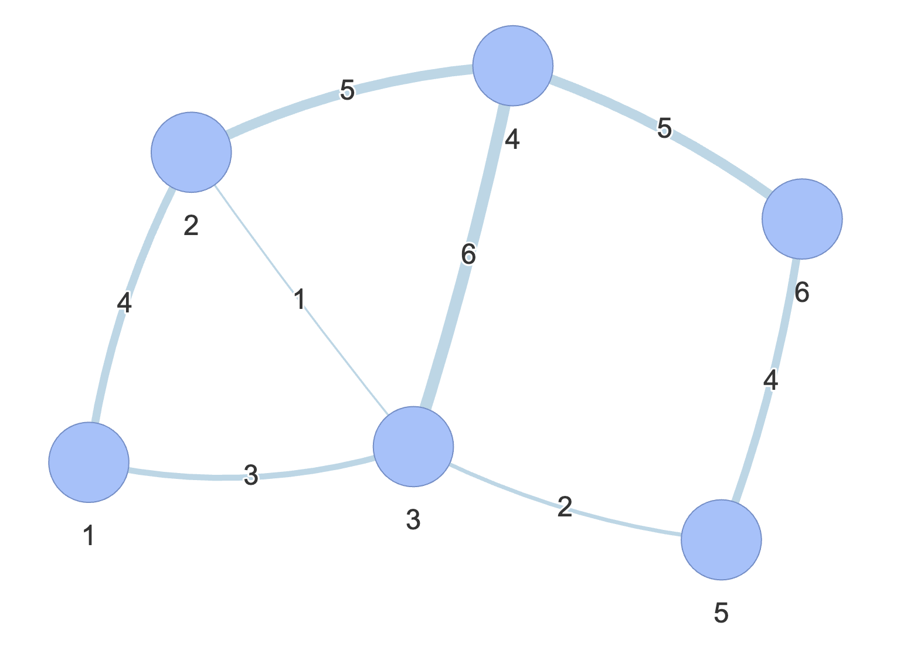
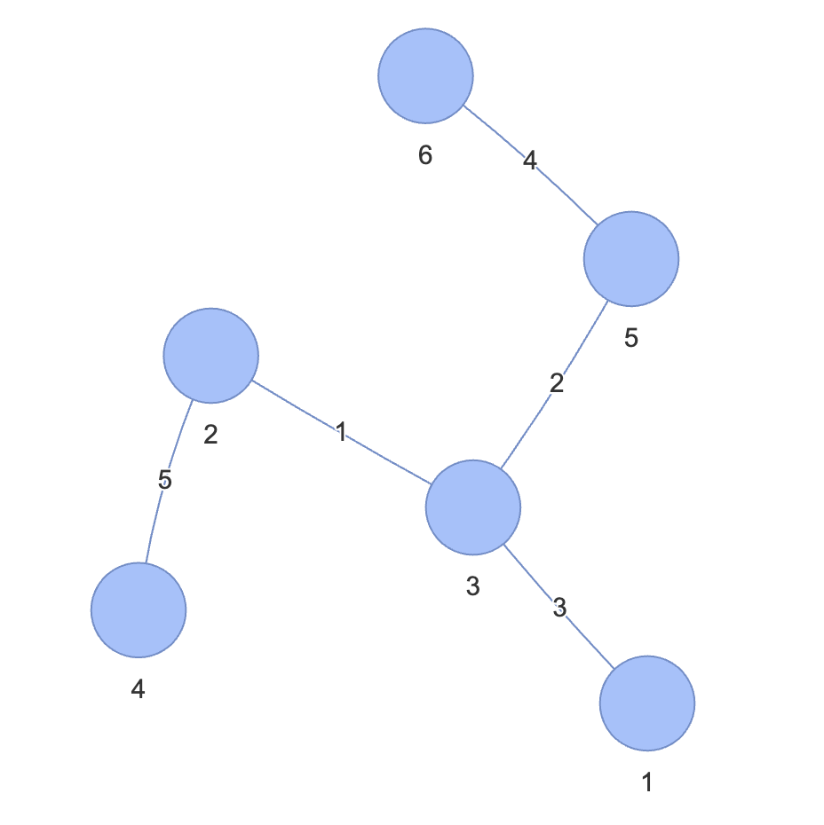

## 최소 신장 트리란 ?

그래프에서 모든 노드를 연결할 때, 사용된 엣지들의 가중치의 합을 <br>
최소로 하는 트리.

### 특징

1. 사이클이 포함되면 가중치의 합이 최소가 될 수 없으므로 사이클을 포함하지 않음
2. N개의 노드가 있으면 치ㅗ소 신장 트리를 구성하는 엣지의 개수는 항상 N-1 개이다

## 과정

### 초기 가중치 그래프 (노드 6개)


<br>
<br>

### 1. 엣지 리스트로 그래프를 구현하고 유니온 파인드 배열 초기화 하기

최소 신장 트리 알고리즘 중 크루스칼 알고리즘은 엣지를 중심으로 동작하므로, 그래프를 인접 리스트보다는 엣지 리스트 형태로 저장하는 것이 효율적입니다. 엣지 리스트는 각 엣지의 정보 (출발 노드, 도착 노드, 가중치)를 담고 있는 리스트입니다.

``` java
class Edge {
	int from;
	int to;
	int weight;

	public Edge(int from, int to, int weight) {
		this.from = from;
		this.to = to;
		this.weight = weight;
	}
}

List<Edge> edges = new ArrayList<>();
edges.add(new Edge(1, 2, 4));
edges.add(new Edge(1, 3, 3));
edges.add(new Edge(2, 3, 1));
edges.add(new Edge(2, 4, 5));
edges.add(new Edge(3, 4, 6));
edges.add(new Edge(3, 5, 2));
edges.add(new Edge(4, 6, 5));
edges.add(new Edge(5, 6, 4));

// 유니온파인드 배열
int[] parent = new int[7]; // 노드 번호가 1부터 시작하므로 크기를 7로 설정
for (int i = 1; i < parent.length; i++) {
	parent[i] = i;
}
```

### 2. 그래프 데이터를 가중치 기준으로 정렬하기

크루스칼 알고리즘은 가중치가 가장 낮은 엣지부터 고려하므로, 엣지 리스트를 가중치를 기준으로 오름차순 정렬합니다.

```java
import java.util.Collections;
import java.util.Comparator;

Collections.sort(edges, Comparator.comparingInt(e -> e.weight));
```

정렬 후 엣지 리스트는 다음과 같을 수 있습니다.

| 출발 노드 | 도착 노드 | 가중치 |
|---|---|---|
| 2 | 3 | 1 |
| 3 | 5 | 2 |
| 1 | 3 | 3 |
| 1 | 2 | 4 |
| 5 | 6 | 4 |
| 2 | 4 | 5 |
| 4 | 6 | 5 |
| 3 | 4 | 6 |


### 3. 가중치가 낮은 에지부터 연결 시도하기

정렬된 엣지 리스트를 순회하면서, 가중치가 낮은 엣지부터 차례대로 연결을 시도합니다. <br>
이때, 연결하려는 두 노드가 이미 같은 집합에 속해 있다면 사이클이 형성되므로 연결하지 않습니다. <br>
유니온 파인드 연산을 통해 사이클 형성 여부를 판단합니다.

**과정:**

1. 현재 엣지 리스트에서 가장 가중치가 낮은 엣지를 하나 선택합니다.
2. 선택된 엣지의 두 노드를 확인합니다. 편의상 각각 `a`와 `b`라고 부르겠습니다.
3. 유니온 파인드 자료 구조의 `find` 연산을 사용하여 노드 `a`와 노드 `b`가 속한 집합의 대표 노드를 각각 찾습니다.
4. 만약 `find(a)`의 결과와 `find(b)`의 결과가 다르다면, 이는 노드 `a`와 노드 `b`가 아직 같은 연결 요소에 속해 있지 않다는 의미입니다. 따라서 이 엣지를 최소 신장 트리에 추가해도 사이클이 생기지 않습니다.
	- 엣지를 최소 신장 트리에 추가합니다.
	- 유니온 파인드 자료 구조의 `union` 연산을 사용하여 노드 `a`와 노드 `b`가 속한 두 집합을 하나로 합칩니다.
5. 만약 `find(a)`의 결과와 `find(b)`의 결과가 같다면, 이는 노드 `a`와 노드 `b`가 이미 같은 연결 요소에 속해 있다는 의미입니다. 따라서 이 엣지를 추가하면 사이클이 형성되므로, 이 엣지는 건너뛰고 다음 엣지를 고려합니다.
6. 엣지 리스트의 모든 엣지를 검토하거나, 최소 신장 트리에 필요한 `N-1`개의 엣지가 모두 추가될 때까지 이 과정을 반복합니다 (여기서 `N`은 그래프의 총 노드 수입니다).


### 4. 과정 3 반복하기

모든 엣지를 순회하거나, 최소 신장 트리에 `N-1`개의 엣지가 포함될 때까지 과정 3을 반복합니다 (N은 노드의 개수).


### 5. 총 엣지 비용 출력하기

최소 신장 트리를 구성하는 모든 엣지를 선택한 후, 선택된 엣지들의 가중치 합을 계산하여 총 엣지 비용을 출력합니다. 이 값이 최소 신장 트리의 총 가중치가 됩니다.

> 사이클이 존재하지 않아야 하므로 , 유니온 파인드를 이용해서 사이클을 판별하는 알고리즘을 내장시켜야 함.

## 과정 추이

아래는 주어진 그래프에 대해 크루스칼 알고리즘을 적용하여 최소 신장 트리를 찾는 과정을 단계별로 보여줍니다. <br>
초기 `parent` 배열은 `[1, 2, 3, 4, 5, 6]` 입니다.

1. **엣지 (2, 3, 1):**
	- `find(2) = 2`, `find(3) = 3`. 대표 노드가 다르므로 연결합니다.
	- `union(2, 3)` 수행. `parent` 배열은 `[1, 2, 2, 4, 5, 6]` 이 됩니다.
	- 현재 MST 엣지: `(2, 3, 1)`

2. **엣지 (3, 5, 2):**
	- `find(3) = 2`, `find(5) = 5`. 대표 노드가 다르므로 연결합니다.
	- `union(3, 5)` 수행. `parent` 배열은 `[1, 2, 2, 4, 2, 6]` 이 됩니다.
	- 현재 MST 엣지: `(2, 3, 1), (3, 5, 2)`

3. **엣지 (1, 3, 3):**
	- `find(1) = 1`, `find(3) = 2`. 대표 노드가 다르므로 연결합니다.
	- `union(1, 3)` 수행. `parent` 배열은 `[1, 1, 1, 4, 1, 6]` 이 됩니다.
	- 현재 MST 엣지: `(2, 3, 1), (3, 5, 2), (1, 3, 3)`

4. **엣지 (1, 2, 4):**
	- `find(1) = 1`, `find(2) = 1`. 대표 노드가 같으므로 사이클이 형성되어 연결하지 않습니다.

5. **엣지 (5, 6, 4):**
	- `find(5) = 1`, `find(6) = 6`. 대표 노드가 다르므로 연결합니다.
	- `union(5, 6)` 수행. `parent` 배열은 `[1, 1, 1, 4, 1, 1]` 이 됩니다.
	- 현재 MST 엣지: `(2, 3, 1), (3, 5, 2), (1, 3, 3), (5, 6, 4)`

6. **엣지 (2, 4, 5):**
	- `find(2) = 1`, `find(4) = 4`. 대표 노드가 다르므로 연결합니다.
	- `union(2, 4)` 수행. `parent` 배열은 `[1, 1, 1, 1, 1, 1]` 이 됩니다.
	- 현재 MST 엣지: `(2, 3, 1), (3, 5, 2), (1, 3, 3), (5, 6, 4), (2, 4, 5)`

7. **엣지 (4, 6, 5):**
	- `find(4) = 1`, `find(6) = 1`. 대표 노드가 같으므로 사이클이 형성되어 연결하지 않습니다.

8. **엣지 (3, 4, 6):**
	- `find(3) = 1`, `find(4) = 1`. 대표 노드가 같으므로 사이클이 형성되어 연결하지 않습니다.

최소 신장 트리를 구성하는 엣지는 총 5개이며, 이는 노드 개수 6개에서 1을 뺀 값과 같습니다. 선택된 엣지와 그 가중치의 합은 다음과 같습니다.



<br>
<br>


- (2, 3): 1
- (3, 5): 2
- (1, 3): 3
- (5, 6): 4
- (2, 4): 5

**총 가중치 합: 1 + 2 + 3 + 4 + 5 = 15**
```
