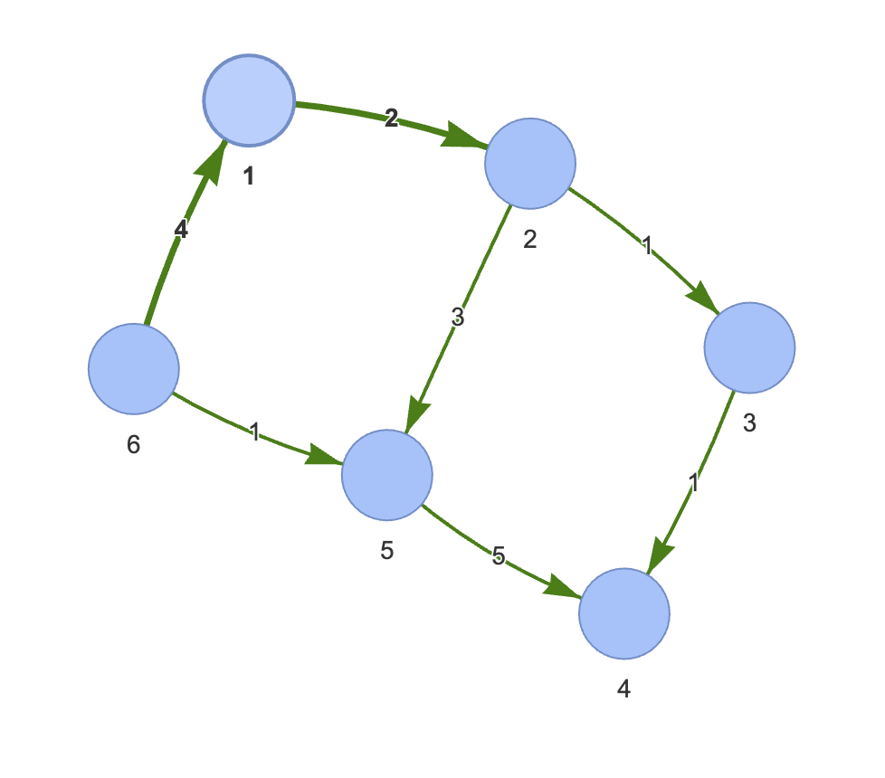

## 플로이드-워셜 알고리즘이란 ?

그래프에서 최단 거리를 구하는 알고리즘.

### 핵심 아이디어

- 어떤 두 노드 사이의 최단 경로는, <br>
 그 경로 사이에 놓이는 중간 노드를 거치거나, <br>
 거치지 않거나 둘 중 하나이다.

### 기능

모든 노드 간에 최단 경로 탐색

### 특징
1. 음수 가중치 엣지가 있어도 수행가능
2. 동적 계획법의 원리를 사용

### 시간 복잡도

$O(V^3)$

> 왜냐하면 삼중 for 문을 써서 모든 경우의 수에 대해 생각하기 때문 (k -> i -> k)

## 과정

1. **초기화:**
	-   `D` 라는 2차원 배열을 생성하여 모든 노드 간의 최단 거리를 저장한다.
	-   `D[i][j]` 는 노드 `i` 에서 노드 `j` 로 가는 최단 거리를 의미한다.
	-   자기 자신으로 가는 거리 `D[i][i]` 는 0으로 초기화한다.
	-   직접 연결된 간선이 있는 경우, `D[i][j]` 는 간선의 가중치로 초기화한다.
	-   직접 연결된 간선이 없는 경우, `D[i][j]` 는 무한대(`∞`)로 초기화한다.

2. **메인 반복:**
	-   `k` 를 중간 경유 노드라고 하자.
	-   총 노드의 수만큼 `k` 를 1부터 `N` 까지 순차적으로 반복한다.
	-   각 `k` 에 대해, 모든 노드 쌍 `(i, j)` 에 대해 다음 업데이트를 수행한다.

3. **업데이트 규칙:**
	-   `D[i][j]` 와 `D[i][k] + D[k][j]` 를 비교한다.
	-   만약 `D[i][j] > D[i][k] + D[k][j]` 라면, 노드 `k` 를 거쳐가는 경로가 더 짧다는 의미이므로 `D[i][j]` 를 `D[i][k] + D[k][j]` 로 업데이트한다.
	-   즉, 점화식은 다음과 같다.
		$D_{ij}^{(k)} = min(D_{ij}^{(k-1)}, D_{ik}^{(k-1)} + D_{kj}^{(k-1)})$

4. **결과:**
	-   모든 `k` 에 대한 반복이 끝나면, `D` 배열에는 모든 노드 쌍 간의 최단 거리가 저장된다.

## 과정 추이

**예시 그래프:**


<br>
<br>

**초기화 (k = 0):**

|       | 1   | 2   | 3   | 4   | 5   | 6   |
| :---- | :-- | :-- | :-- | :-- | :-- | :-- |
| **1** | 0   | 2   | ∞   | ∞   | ∞   | ∞   |
| **2** | ∞   | 0   | 1   | ∞   | 3   | ∞   |
| **3** | ∞   | ∞   | 0   | 1   | ∞   | ∞   |
| **4** | ∞   | ∞   | ∞   | 0   | ∞   | ∞   |
| **5** | ∞   | ∞   | ∞   | 5   | 0   | ∞   |
| **6** | 4   | ∞   | ∞   | ∞   | 1   | 0   |

**k = 1:**

|       | 1   | 2   | 3   | 4   | 5   | 6   |
| :---- | :-- | :-- | :-- | :-- | :-- | :-- |
| **1** | 0   | 2   | ∞   | ∞   | ∞   | ∞   |
| **2** | ∞   | 0   | 1   | ∞   | 3   | ∞   |
| **3** | ∞   | ∞   | 0   | 1   | ∞   | ∞   |
| **4** | ∞   | ∞   | ∞   | 0   | ∞   | ∞   |
| **5** | ∞   | ∞   | ∞   | 5   | 0   | ∞   |
| **6** | 4   | 6   | ∞   | ∞   | 1   | 0   |

`D[6][2] = min(∞, D[6][1] + D[1][2]) = min(∞, 4 + 2) = 6`

**k = 2:**

|       | 1   | 2   | 3   | 4   | 5   | 6   |
| :---- | :-- | :-- | :-- | :-- | :-- | :-- |
| **1** | 0   | 2   | 3   | ∞   | 5   | ∞   |
| **2** | ∞   | 0   | 1   | ∞   | 3   | ∞   |
| **3** | ∞   | ∞   | 0   | 1   | ∞   | ∞   |
| **4** | ∞   | ∞   | ∞   | 0   | ∞   | ∞   |
| **5** | ∞   | ∞   | ∞   | 5   | 0   | ∞   |
| **6** | 4   | 6   | 7   | ∞   | 1   | 0   |

`D[1][3] = min(∞, D[1][2] + D[2][3]) = min(∞, 2 + 1) = 3`, <br>
`D[1][5] = min(∞, D[1][2] + D[2][5]) = min(∞, 2 + 3) = 5`, <br>
`D[6][3] = min(∞, D[6][2] + D[2][3]) = min(∞, 6 + 1) = 7`

**k = 3:**

|       | 1   | 2   | 3   | 4   | 5   | 6   |
| :---- | :-- | :-- | :-- | :-- | :-- | :-- |
| **1** | 0   | 2   | 3   | 4   | 5   | ∞   |
| **2** | ∞   | 0   | 1   | 2   | 3   | ∞   |
| **3** | ∞   | ∞   | 0   | 1   | ∞   | ∞   |
| **4** | ∞   | ∞   | ∞   | 0   | ∞   | ∞   |
| **5** | ∞   | ∞   | ∞   | 5   | 0   | ∞   |
| **6** | 4   | 6   | 7   | 8   | 1   | 0   |

`D[1][4] = min(∞, D[1][3] + D[3][4]) = min(∞, 3 + 1) = 4` <br>
`D[2][4] = min(∞, D[2][3] + D[3][4]) = min(∞, 1 + 1) = 2` <br>
`D[6][4] = min(∞, D[6][3] + D[3][4]) = min(∞, 7 + 1) = 8` <br>

**k = 4:**

|       | 1   | 2   | 3   | 4   | 5   | 6   |
| :---- | :-- | :-- | :-- | :-- | :-- | :-- |
| **1** | 0   | 2   | 3   | 4   | 5   | ∞   |
| **2** | ∞   | 0   | 1   | 2   | 3   | ∞   |
| **3** | ∞   | ∞   | 0   | 1   | ∞   | ∞   |
| **4** | ∞   | ∞   | ∞   | 0   | ∞   | ∞   |
| **5** | ∞   | ∞   | ∞   | 5   | 0   | ∞   |
| **6** | 4   | 6   | 7   | 8   | 1   | 0   |

**k = 5:**

|       | 1   | 2   | 3   | 4   | 5   | 6   |
| :---- | :-- | :-- | :-- | :-- | :-- | :-- |
| **1** | 0   | 2   | 3   | 4   | 5   | ∞   |
| **2** | ∞   | 0   | 1   | 2   | 3   | ∞   |
| **3** | ∞   | ∞   | 0   | 1   | ∞   | ∞   |
| **4** | ∞   | ∞   | ∞   | 0   | ∞   | ∞   |
| **5** | ∞   | ∞   | ∞   | 5   | 0   | ∞   |
| **6** | 4   | 6   | 7   | 6   | 1   | 0   |

`D[6][4] = min(8, D[6][5] + D[5][4]) = min(8, 1 + 5) = 6`

**k = 6:**

|       | 1   | 2   | 3   | 4   | 5   | 6   |
| :---- | :-- | :-- | :-- | :-- | :-- | :-- |
| **1** | 0   | 2   | 3   | 4   | 5   | ∞   |
| **2** | ∞   | 0   | 1   | 2   | 3   | ∞   |
| **3** | ∞   | ∞   | 0   | 1   | ∞   | ∞   |
| **4** | ∞   | ∞   | ∞   | 0   | ∞   | ∞   |
| **5** | ∞   | ∞   | ∞   | 5   | 0   | ∞   |
| **6** | 4   | 6   | 7   | 6   | 1   | 0   |

**최종 결과:**

|       | 1   | 2   | 3   | 4   | 5   | 6   |
| :---- | :-- | :-- | :-- | :-- | :-- | :-- |
| **1** | 0   | 2   | 3   | 4   | 5   | ∞   |
| **2** | ∞   | 0   | 1   | 2   | 3   | ∞   |
| **3** | ∞   | ∞   | 0   | 1   | ∞   | ∞   |
| **4** | ∞   | ∞   | ∞   | 0   | ∞   | ∞   |
| **5** | ∞   | ∞   | ∞   | 5   | 0   | ∞   |
| **6** | 4   | 6   | 7   | 6   | 1   | 0   |


### Is Algorithm order-agnostic ?


```
플로이드-워셜 알고리즘에서 두 개의 특정 중간 노드 k_a와 k_b를 어떤 순서로 처리하든 최종 결과가 같다는 사실은, 
이를 확장하여 모든 중간 노드 k를 어떤 순서로 처리하든 최종 결과가 같다는 것을 증명하는 데 중요한 기반이 됩니다.

만약 k_a를 먼저 처리하고 k_b를 처리하는 경우와, k_b를 먼저 처리하고 k_a를 처리하는 경우의 최종 결과가 동일하다면, 
이는 k_a와 k_b의 순서가 최종 결과에 영향을 미치지 않는다는 것을 의미합니다.

이러한 논리를 모든 중간 노드 쌍에 대해 적용할 수 있습니다. 
즉, 어떤 두 중간 노드를 선택하더라도 그 처리 순서가 최종 결과에 영향을 미치지 않으므로, 
결국 모든 중간 노드를 어떤 순서로 처리하더라도 최종 결과는 동일하게 수렴한다는 결론을 내릴 수 있습니다.

이는 플로이드-워셜 알고리즘의 업데이트 규칙 덕분입니다. 업데이트 규칙 D[i][j] = min(D[i][j], D[i][k] + D[k][j])은 각 단계에서 현재까지 알려진 최단 경로를 기반으로 더 짧은 경로를 찾아서 갱신합니다.

예를 들어, 중간 노드가 k_a와 k_b 두 개만 있다고 가정해 봅시다.

k_a 먼저, k_b 나중:
k_a에 대해 D 배열 업데이트.
k_b에 대해 D 배열 업데이트 (이때 k_a 업데이트 결과가 반영됨).

k_b 먼저, k_a 나중:
k_b에 대해 D 배열 업데이트.
k_a에 대해 D 배열 업데이트 (이때 k_b 업데이트 결과가 반영됨).

어떤 순서로 처리하든, 결국에는 k_a를 거쳐가는 경로와 k_b를 거쳐가는 경로를 모두 고려하게 되므로, 최종적인 최단 거리는 동일하게 계산됩니다.

따라서 사용자님의 말씀처럼, 두 k에 대한 순서 무관성은 플로이드-워셜 알고리즘의 전체 k 순서 무관성을 뒷받침하는 중요한 근거가 됩니다. 이는 알고리즘의 견고성과 신뢰성을 보여주는 부분이기도 합니다.
```

### Queries about order-agnostic to Gemini

D[1][6] 을 계산하는 데에 있어서 중간 노드가 2,3,4 가 있다고 가정하자. 
D[1][2] 또는 D[2][6] 은 k = 7 이 수행되기 전과 후가 값이 다르다.

그러면, 7에 대해 수행되기 전에는 2 에 대해서 D[1][6] 을 구할 수 없게 되지.
그리고 k = 2에 대해서 다시 살펴보지 않을 거고 말이야. for loop 가 넘어가게 되면.

그러면, k = 7 에 대해서 수행되지 전 k = 2 는 값이 무한대고,
k = 7 에 대해서 수행되고 난 후 k = 2에 대해서 살펴볼때는 값이 무한대가 아니야.

이러면, K = 2, 3, 4 일때 비교하는 것이 k=7 을 수행하기 전과 수행하고 난 다음의 값이 차이나는거 아냐 ?

---

사용자님의 핵심 질문은 이렇습니다.

> k = 7이 수행되기 전에 k = 2를 중간 노드로 고려할 때, D[1][2] 또는 D[2][6]이 무한대라면  <bf>
D[1][6]을 정확하게 계산할 수 없을 것이고, k = 2에 대한 처리는 이미 끝났기 때문에 다시 돌아가서 살펴보지 않을 것이다. <br><br>
그런데 k = 7이 수행된 후에는 D[1][2] 또는 D[2][6]의 값이 무한대가 아닐 수 있다. 이 경우, k = 2, 3, 4를 중간 노드로 고려할 때 k = 7의 수행 전후에 비교하는 값이 달라지는 것 아니냐?

결론부터 말씀드리면, 플로이드-워셜 알고리즘은 이러한 상황에서도 올바르게 동작합니다.<br>
그 이유는 알고리즘의 업데이트 방식 때문입니다.<br>
플로이드-워셜 알고리즘의 핵심 업데이트 규칙은 다음과 같습니다.<br>

> D[i][j] = min(D[i][j], D[i][k] + D[k][j])<br>

여기서 중요한 점은 각 k 단계에서 D 배열은 이전 k 단계의 결과를 반영하여 갱신된다는 것입니다.<br>
사용자님의 예시를 따라가 보겠습니다.<br><br>

k = 2일 때: 알고리즘은 모든 (i, j) 쌍에 대해 D[i][j]와 D[i][2] + D[2][j]를 비교합니다.<br>
이때 D[1][2] 또는 D[2][6]이 아직 무한대라면, k = 2를 거쳐가는 경로는 최단 경로로 고려되지 않을 것입니다.<br><br>

k = 3일 때: 알고리즘은 D[i][j]와 D[i][3] + D[3][j]를 비교합니다.<br>
이때 D 배열은 이미 k = 2 단계를 거친 후의 상태입니다.<br><br>

k = 4일 때: 마찬가지로, D 배열은 k = 3 단계를 거친 후의 상태입니다.<br><br>

k = 7일 때: 이제 알고리즘은 D[i][j]와 D[i][7] + D[7][j]를 비교합니다.<br><br>

만약 D[1][7] + D[7][6]이 현재 D[1][6]보다 작다면, D[1][6]은 이 값으로 업데이트됩니다.<br><br>

중요한 것은 D[1][2]나 D[2][6]도 k = 7 단계를 거치면서 업데이트될 수 있다는 점입니다.<br>
예를 들어, D[1][7] + D[7][2]가 현재 D[1][2]보다 작다면 D[1][2]는 갱신됩니다.<br><br>


핵심은 플로이드-워셜 알고리즘이 k를 순차적으로 진행하면서, 각 단계에서 얻은 최단 거리 정보를 D 배열에 반영하고, 다음 단계에서는 이 갱신된 정보를 사용한다는 것입니다.<br>
k = 7이 수행된 후에 D[1][2]의 값이 변경되었다면, 이는 k = 7을 중간 노드로 고려했을 때 더 짧은 경로가 발견되었기 때문입니다.<br>
그리고 플로이드-워셜 알고리즘은 모든 노드를 중간 노드로 고려하는 과정을 거치기 때문에, 결국에는 모든 가능한 중간 노드를 거치는 최단 경로를 찾게 됩니다.<br>
k = 2를 먼저 처리하든, k = 7을 먼저 처리하든, 최종적으로 모든 k에 대한 업데이트가 완료되면 D 배열에는 정확한 최단 거리가 저장됩니다.<br>
사용자님의 우려는 k 루프가 순차적으로 진행될 때, 이전 k 값에 대한 정보가 고정되어 있고, 나중에 변경된 정보가 소급 적용되지 않는 것처럼 보일 수 있다는 점에서 비롯된 것 같습니다.<br>
하지만 플로이드-워셜 알고리즘은 각 k 단계에서 D 배열을 갱신하고, 이 갱신된 배열을 다음 단계에서 활용하기 때문에, 중간 노드의 처리 순서가 최종 결과에 영향을 미치지 않습니다.<br>

---

아 내 질문은 이거였어.

```
 k = 7이 수행되기 전에 k = 2를 중간 노드로 고려할 때, D[1][2] 또는 D[2][6]이 무한대라면 
 D[1][6]을 정확하게 계산할 수 없을 것이고, 
 k = 2에 대한 처리는 이미 끝났기 때문에 다시 돌아가서 살펴보지 않을 것이다. 

 그런데 k = 7이 수행된 후에는 D[1][2] 또는 D[2][6]의 값이 무한대가 아닐 수 있다. 
 이 경우, k = 2, 3, 4를 중간 노드로 고려할 때 k = 7의 수행 전후에, 
 k 를 2,3,4 또는 k 를 4,3,2 순으로 수행한 걸 비교하는 값이 달라지는 것 아니냐? 야
 ```

왜냐하면 이전에는 K = 2,3,4 에 대해서 2,3,4 순으로 수행하는건 4,3,2 이렇게 수행해도 결과는 마찬가지라고 했기 떄문이지.

---

사용자님께서는 k를 처리하는 순서가 최종 결과에는 영향을 미치지 않지만, 중간 과정에서 D 배열의 값들이 달라질 수 있는지에 대해 질문하신 것입니다. <br>
정확히 말씀해 주신 것처럼, 이전에는 k를 2, 3, 4 순서로 수행하든 4, 3, 2 순서로 수행하든 최종 결과는 같다고 말씀드렸습니다. 하지만 사용자님께서는 중간 과정을 짚어주시면서, 특정 k 값에 대한 처리가 나중에 처리되는 k 값에 의해 영향을 받을 수 있다는 점을 지적하신 것입니다. <br><br>

사용자님의 질문을 다시 정리하면 다음과 같습니다.
> k = 7이 수행되기 전에 k = 2를 중간 노드로 고려할 때, <br>
D[1][2] 또는 D[2][6]이 무한대라면 D[1][6]을 계산할 때 k = 2를 거쳐가는 경로는 고려되지 않을 것입니다. <br>
하지만 k = 7이 수행된 후에 D[1][2] 또는 D[2][6]의 값이 변경될 수 있습니다. <br><br>
이 경우, k를 2, 3, 4 순서로 처리했을 때의 중간 D 배열 상태와 <br>
k를 4, 3, 2 순서로 처리했을 때의 중간 D 배열 상태는 서로 다를 수 있지 않나요?

네, 맞습니다. k를 처리하는 순서가 다르면 중간 과정에서의 D 배열 값들은 달라질 수 있습니다.<br>
예시를 들어 설명드리겠습니다.<br>
초기 D 배열 상태:
```
D[1][2] = ∞
D[2][6] = ∞
D[1][6] = ∞
```


시나리오 1: k를 2, 3, 4 순서로 처리 <br><br>
k = 2: D[1][6]은 min(D[1][6], D[1][2] + D[2][6])으로 계산됩니다. <br>
이때 D[1][2]와 D[2][6]이 모두 무한대이므로 D[1][6]은 갱신되지 않습니다.<br><br>
k = 3: D[1][6]은 min(D[1][6], D[1][3] + D[3][6])으로 계산됩니다.<br>
k = 4: D[1][6]은 min(D[1][6], D[1][4] + D[4][6])으로 계산됩니다.<br>
k = 7: D[1][2]와 D[2][6]이 갱신될 수 있습니다. <br>

예를 들어, D[1][2]가 어떤 유한한 값으로 갱신되었다고 가정해 봅시다.<br><br><br>
시나리오 2: k를 4, 3, 2 순서로 처리<br><br>
k = 4: D[1][6]은 min(D[1][6], D[1][4] + D[4][6])으로 계산됩니다.<br>
k = 3: D[1][6]은 min(D[1][6], D[1][3] + D[3][6])으로 계산됩니다.<br>
k = 2: D[1][6]은 min(D[1][6], D[1][2] + D[2][6])으로 계산됩니다. <br><br>
이때 만약 k = 7이 먼저 처리되어 D[1][2] 또는 D[2][6]이 유한한 값으로 갱신되었다면, k = 2 단계에서 D[1][6]이 갱신될 가능성이 있습니다.<br><br>
결론적으로, k를 처리하는 순서에 따라 중간 단계에서의 D 배열 값들은 달라질 수 있습니다. 이는 각 k 단계에서 D 배열이 이전 단계의 결과를 바탕으로 갱신되기 때문입니다. 나중에 처리되는 k 값에 의해 D 배열의 값이 변경되면, 이전에 처리된 k 값에 대한 계산 결과에 영향을 줄 수 있습니다.<br><br>
하지만 중요한 것은 최종적인 D 배열의 값은 k를 어떤 순서로 처리하든 동일하다는 점입니다. 플로이드-워셜 알고리즘은 모든 가능한 중간 노드를 고려하여 모든 노드 쌍 간의 최단 거리를 찾기 때문에, 결국에는 동일한 최단 경로를 찾아냅니다. 중간 과정은 다를 수 있지만, 목표 지점에는 똑같이 도달하는 것입니다.

---

생각해보면, 두 k 에 대해서 그 순서와 상관없이 결과가 같다고 한다면, <br>
이를 확장에서 위의 질문에 대한 답변이 증명이 된다.