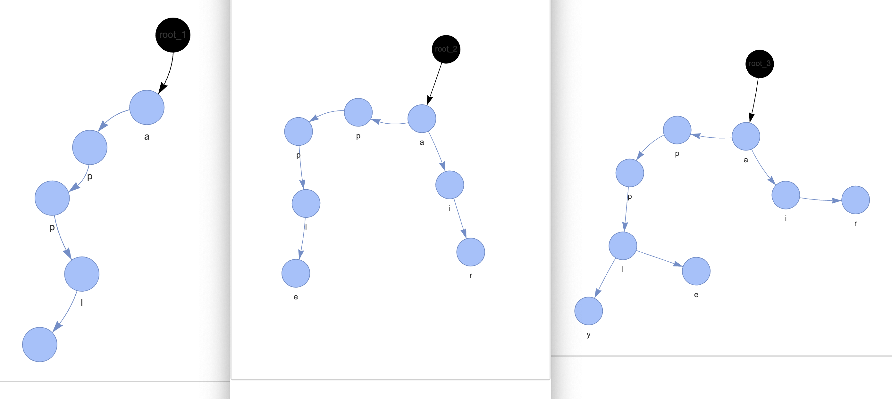

## 트라이란 ?

문자열 검색을 빠르게 실행할 수 있도록 설계한 트리 형태의 자료 구조

## 특징

1. N진 트리 : 문자 종류의 갯수에 따라 N 이 결정됨.  
예를 들어, 알파벳은 26개의 문자 -> 26진 트리

2. 루트 노드는 항상 빈 문자열을 뜻하는 공백 상태를 유지

 

 
 

(왼쪽 순서부터 apple, air, apply 를 트라이에 추가한 모습)

