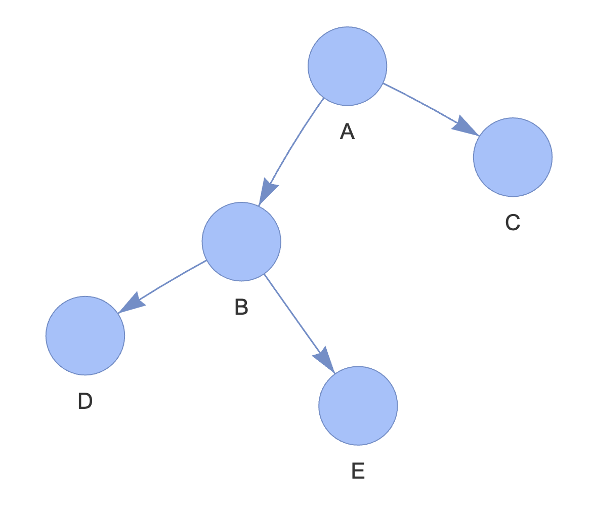

## 트리란 ?

트리는 노드와 엣지로 연결된 그래프의 특수한 형태.

### 특징
1. 순환 구조 (cycle) 이 없고, 1개의 루트 노드가 존재함
2. 루트 노드를 제외한 노드는 단 1개의 부모 노드를 갖는다
3. 트리의 부분 트리 (subtree) 역시 트리의 모든 특징을 따른다

 

 
 

### 구성요소

- 노드
    - 데이터의 index, value 를 표현하는 요소 (A, B, C, D, E)
- 루트노드
    - 최상위 노드 (A)
- 엣지
    - 노드와 노드의 연결 관계를 나타내는 선 (A-C, ... )
- 부모 노드
    - 두 노드의 관계에서 상위 노드에 해당하는 노드
    - ( B, D 에 대해, B 가 부모 노드)
- 자식 노드
    - 두 노드의 관계에서 하위 노드에 해당하는 노드
    - ( B, D 에 대해, D 가 자식 노드)
- 리프 노드
    - 트리에서 가장 하위에 존재하는 녿, (자식 노드가 없음)
    - ( D, E, C )
- 서브 트리
    - 전체 트리에 속한 작은 트리. 부분 트리.
    - ( B, D, E 로 이루어진 트리는 위 트리의 서브트리이다. )

